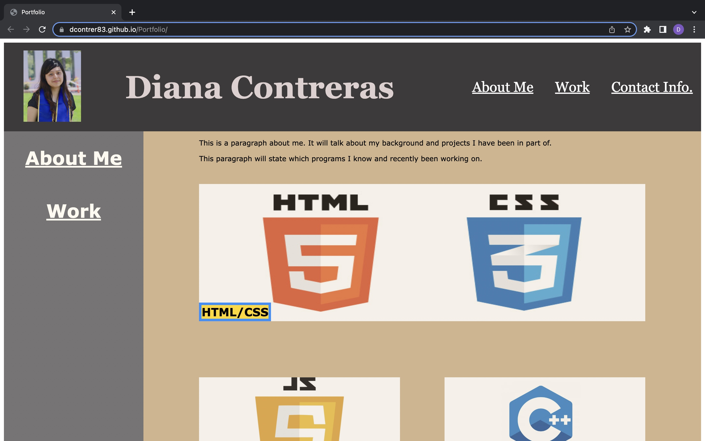
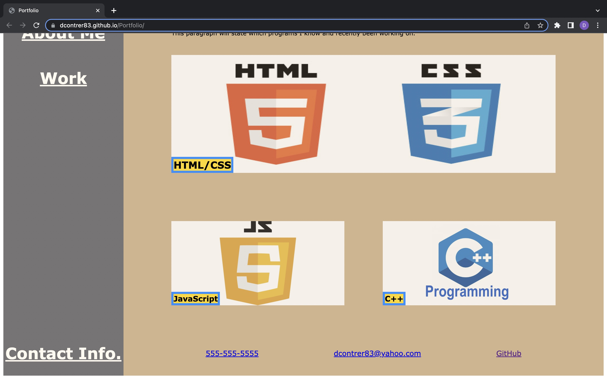

# Portfolio
<h2>Description</h2>
  

This website is a portfolio of the programs I have learned and expanding my knowledge with. It has an About Me, Work, and Contact Info sections. The picture in the work section link to the projects I worked on and planning to in the future. (I did not put my number)

  
<h2>Screenshots<h2>

<h2>Link</h2>

<a href="https://dcontrer83.github.io/Portfolio/">Portfolio</a>